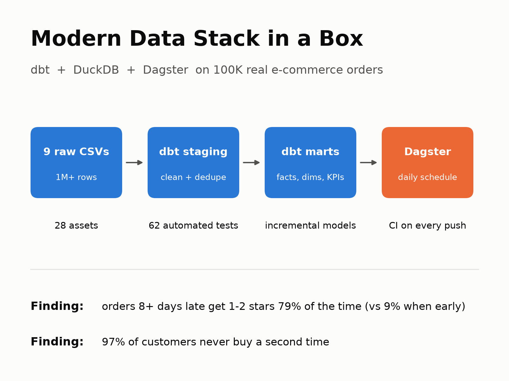
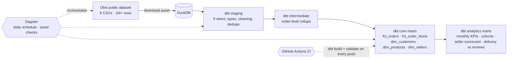
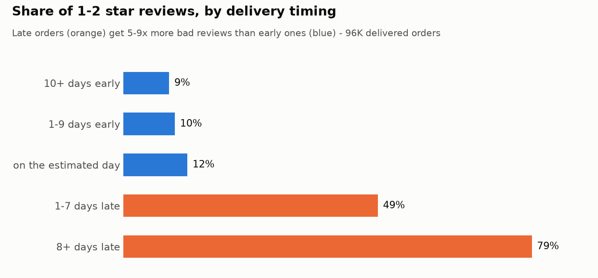
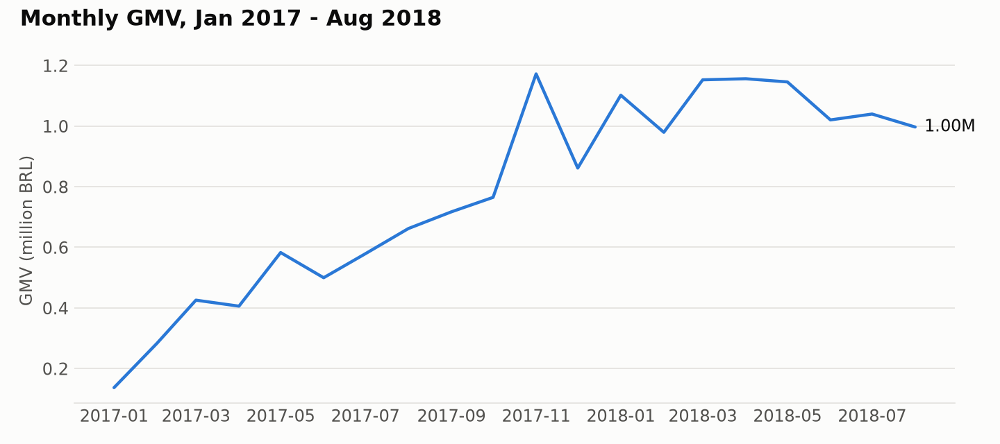

# Modern Data Stack in a Box

**An end-to-end, production-style analytics platform on 100K real e-commerce orders, built with dbt, DuckDB and Dagster.** Raw CSVs go in; tested, documented fact and dimension tables and business KPI marts come out, on a daily schedule, with CI on every push.



It runs on a laptop in about a minute, costs nothing, and uses the same patterns I use on cloud warehouses (Redshift, Snowflake, BigQuery): layered dbt models, incremental loads, data-quality tests, asset-based orchestration and CI.

---

## What it does



| Layer | Models | What happens there |
|---|---|---|
| **Sources** | 9 raw CSVs | Read directly by DuckDB (`read_csv_auto`), no load step needed |
| **Staging** | 9 views | Renaming, typing, zip-code padding, deduplicating reviews, collapsing 1M geolocation rows to 19K zip prefixes |
| **Intermediate** | 3 ephemeral | Payment and item rollups per order; purchase sequence per real customer |
| **Core marts** | 5 tables | `fct_orders`, `fct_order_items` (**incremental**, 3-day lookback), `dim_customers`, `dim_products`, `dim_sellers` |
| **Analytics marts** | 4 tables | Monthly KPIs, cohort retention + cumulative revenue, seller scorecard, delivery timing vs review score |

**Orchestration:** Dagster loads the dbt project as **28 software-defined assets**. The raw download is an asset too, so lineage runs from source file to KPI table. dbt tests show up as **asset checks**. A `daily_refresh` job runs everything at 06:00 UTC.

---

## Data quality: real problems found and handled

The raw data is messy, like every real dataset. Profiling it first turned up these issues, and each one is handled in the models and guarded by a test:

| Problem in the raw data | How it's handled |
|---|---|
| **814 duplicate review IDs**; **547 orders have more than one review** | `stg_olist__order_reviews` keeps the latest answered review per order. A **dbt unit test** proves the logic |
| **99,441 customer IDs but only 96,096 real people**: the source issues a new ID for every order | All customer analytics use `customer_unique_id`; `dim_customers` has one row per person |
| **249 orders where the amount paid ≠ items + freight** (by more than 1 BRL) | Flagged with `has_payment_mismatch`; a test **warns** at >0 and **fails** above 500, so the known issue stays visible and a regression still breaks the build |
| Cancelled orders **paid but with no items** | Excluded from the mismatch check (a missing order isn't a price mismatch); excluded from revenue marts |
| **610 products with no category**; **2 categories with no English translation** | A dbt **seed** patches the translations; missing categories become `'unknown'` |
| **1M geolocation rows**, many per zip prefix, with noisy coordinates | Collapsed to one row per prefix using **median** lat/lng |
| Source column misspelled as `product_name_lenght` | Renamed in staging so the typo never spreads downstream |
| First and last months are **partial** | `is_complete_month` flag so charts don't show a fake collapse |

**Test coverage:** 62 tests: uniqueness, not-null, referential integrity (every order → customer, every item → product and seller), accepted values, 1 unit test, and 4 custom business-logic tests (GMV in the KPI mart reconciles to order-level revenue, month-0 cohort retention is exactly 100%, no delivery before purchase, payment reconciliation).

---

## What the data says



- **Late delivery is the #1 driver of bad reviews.** Orders arriving 8+ days late get a 1–2 star review **79%** of the time, against **9%** for orders that arrive early. Fixing logistics beats any marketing campaign for ratings.
- **97% of customers never buy again.** Month-1 cohort retention is about **0.5%**, and cumulative revenue per customer barely moves after the first order. Growth here is almost entirely paid acquisition, so a retention programme is the biggest untapped lever.
- **March 2018 was a delivery crisis:** the late-delivery rate hit **18.5%** and the average review score fell to **3.76**, then recovered to 4.29 once logistics normalised.



---

## Run it yourself

Requires [uv](https://docs.astral.sh/uv/) (it installs Python 3.12 for you).

```bash
git clone https://github.com/VineethVadlapalli/olist-modern-data-stack.git
cd olist-modern-data-stack
make setup      # create the environment
make build      # download data + run all dbt models and tests (~1 min)
make dagster    # open the orchestration UI at http://localhost:3000
make docs       # browse dbt docs and the lineage graph
```

## Project structure

```
├── scripts/download_data.py        # fetches the raw CSVs (also a Dagster asset)
├── olist_dbt/
│   ├── models/staging/             # 1:1 with sources: clean, type, dedupe
│   ├── models/intermediate/        # reusable order-level rollups
│   ├── models/marts/core/          # facts + dimensions
│   ├── models/marts/analytics/     # KPI, cohort, seller, delivery marts
│   ├── seeds/                      # translation patch
│   └── tests/                      # custom business-logic tests
├── orchestration/definitions.py    # Dagster assets, job, schedule
├── .github/workflows/ci.yml        # dbt build + Dagster validation on every push
└── Makefile
```

## Moving it to a cloud warehouse

Nothing here is DuckDB-specific except the adapter. To run on **Snowflake, BigQuery, Redshift or Postgres**: swap `dbt-duckdb` for the matching adapter, point the sources at the loaded raw tables instead of CSVs, and deploy Dagster (Dagster+ or self-hosted). The models, tests and orchestration stay the same.

---

**Dataset:** [Olist Brazilian E-commerce](https://www.kaggle.com/datasets/olistbr/brazilian-ecommerce) (CC BY-NC-SA 4.0), real anonymised orders from 2016–2018.

**Built by Vineeth Vadlapalli**, Data Engineer. I build pipelines, dbt models and analytics that teams trust. [Hire me on Upwork](https://www.upwork.com/freelancers/~017ac26a139c1765cd)
